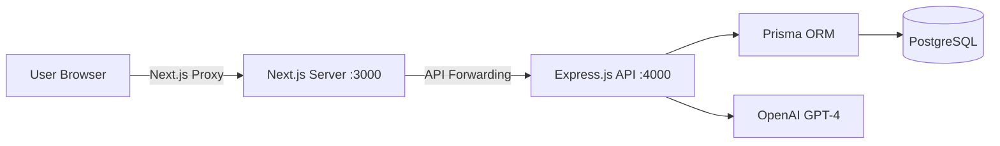

# 🏗 Architecture & Engineering Choices — EduCost AI

This document outlines the technical decisions and architectural patterns used in the EduCost AI project.

## 1. System Architecture

### Key Pattern: The Next.js API Proxy
Instead of making direct cross-origin (CORS) requests to the backend, the frontend uses Next.js `rewrites` to proxy `/api/v1/*` to the backend.
- **Benefit**: Eliminates CORS configuration headaches in production.
- **Benefit**: Securely masks the backend port and allows for easy header manipulation (e.g., security headers).

---

## 2. Frontend Engineering

### State Management: Zustand
We chose **Zustand** over Redux or Context for its simplicity and performance.
- **Hybrid Logic**: The store performs "Local First" calculations (instant feedback) while orchestrating "Cloud Persistence" in the background when authed.
- **Performance**: Prevents unnecessary re-renders in the complex financial simulator.

### Data Visualization: Recharts
A "Human-Centric" financial tool needs visual clarity. Recharts was used to build:
- **DTI Gauge**: Visualizing debt-to-income ratios.
- **Scenario Comparison**: Side-by-side bar charts for comparing "Base" vs "Simulated" future outcomes.
- **Cost Breakdown**: Pie charts for understanding expense distribution.

---

## 3. Backend Engineering

### Modular Pattern (MSC)
The backend is structured into domain-specific modules (Auth, Calculations, AI, Colleges) following the **Model-Controller-Service** pattern:
- **Controllers**: Handle HTTP-specific logic (req, res).
- **Services**: Contain reusable business logic.
- **Middleware**: Centralized validation (express-validator) and error handling.

### Security
- **JWT Authentication**: Short-lived access tokens (15m) and long-lived refresh tokens (7d).
- **Security Headers**: Implementation of `helmet` and custom X-Frame-Options/CSP headers via Next.js.
- **Validation**: Strict schema validation for all financial inputs to prevent corrupted data or injection.

---

## 4. AI Implementation

The **AI Advisor** uses the `gpt-4o-mini` model with a custom prompt engineering strategy:
- **Context Injection**: The frontend sends the current user's financial profile (tuition, EMI, DTI) with every chat request.
- **Safety Rails**: The AI is instructed to provide educational financial advice, not certified legal/financial counsel.

---

## 5. Deployment & DevOps

- **Dockerization**: A multi-stage `Dockerfile` ensures the production image is minimal and secure.
- **Standalone Mode**: Next.js is configured for `output: 'standalone'`, significantly reducing the container footprint by only including necessary `node_modules`.
- **Database Lifecycle**: Prisma handles migrations and seeding, ensuring reproducible environments.
